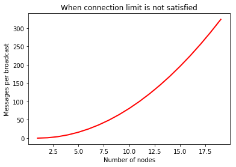
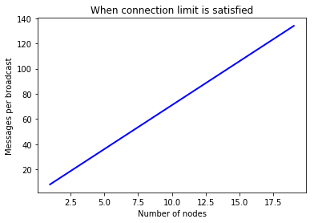
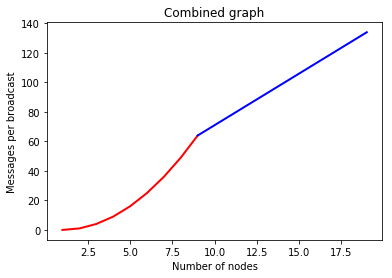

.. contents:: Table of Contents
    :backlinks: none
    :depth: 2

.. sectnum::

########
Abstract
########

This document is meant to describe a peer-to-peer networking protocol that can
be reasonably implemented in any popular language. Its principle goals are

1. Must work with nodes which can only initiate connections ✓
    1. Caveat: at least one node must be able to accept connections ✓
2. Must be capable of network-wide broadcasts ✓
    1. Must scale better than O(N^2) ✓
    2. Lag factor (compared to hub-and-spoke) must be < O(N) ✓
3. Must be capable of broadcasting only to direct peers ✓
4. Must be capable of sending messages to specific nodes ✓
    1. And be able to optionally encrypt it (opt-in or opt-out)
5. Should have public keys as address
6. Should be able to support a `Kademlia`_-like distributed hash table
    1. This table should be able to have locks
    2. This table should be able to support atomic changes
    3. This table should be able to support diff-based changes

#####
Notes
#####

While this document will make references to object diagrams, please be aware
that we are not dictating how you must implement things. If a different
implementation can achieve the same results, then by all means use it,
especially if it's simpler.

Also, this document will largely be written with Python in mind, partly because
it reads like pseudocode, and partly because I am most comfortable with it. I
will try to use type annotations as a guide for static languages.

#########
Constants
#########

=================
Network Constants
=================

These are the set of constants which manage network topology. They determine
things like how many peers one can have, or the number of bits in your address
space. Explanations will be given when these numbers are non-arbitrary.

* ``k``: `Kademlia`_'s replication parameter (max size of k-bucket, # of
  ``STORE`` calls)
* ``α``: `Kademlia`_'s concurrency parameter (number of parallel lookups)
* ``τ``: `Kademlia`_'s address size (number of bits to consider per address/hash)
* ``ℓ``: The limit on a nodes self-initiated connections (in range [1, ``kτ``])

=======
Opcodes
=======

These are the values of the various opcodes used in this project. While they are
arbitrary, they are chosen to take the smallest space possible when serialized.

* ``ACK``: 0
* ``NACK``: 1
* ``PING``: 2
* ``SET_CONNECTION_OPT``: 3
* ``SHOUT``: 4
* ``SPEAK``: 5
* ``WHISPER``: 6
* ``FIND_NODE``: 7
* ``FIND_VALUE``: 8
* ``STORE``: 9

===============================
Connection Options and Settings
===============================

These are the values of the various connection options used in this project. In
the lexicon of this paper, "Option" will refer to a key, while "setting" will
refer to a value. So for the compression option, you can have a setting
``zlib``. While they are arbitrary, they are chosen to take the smallest space
possible when serialized.

~~~~~~~~~~~
Compression
~~~~~~~~~~~

Option: 0

Settings:

* ``bz2``: 0
* ``gzip``: 1
* ``lzma``: 2
* ``zlib``: 3
* ``snappy``: 4

~~~~~~~~~~~~~~~~~~~~~
Preferred Compression
~~~~~~~~~~~~~~~~~~~~~

Option: 1

Settings:

* ``bz2``: 0
* ``gzip``: 1
* ``lzma``: 2
* ``zlib``: 3
* ``snappy``: 4

##############
Message Format
##############

###############
Object Overview
###############

===============
Basic Structure
===============

================
Protocol Parsing
================

=====================
Connection Management
=====================

####
RPCs
####

This section describes how your node should respond to incoming network messages

=====
ACK *
=====

This is the RPC that should be sent back to acknowledge a network message as
successful, and provide return data if necessary.

======
NACK *
======

This is the RPC that should be sent back to acknowledge a network message as
failed, and provide return data if necessary.

====
PING
====

Always respond with ``ACK PING``. This will be utilized heavily in datagram
protocols like UDP or µTP.

=====================================
SET_CONNECTION_OPT <option> <setting>
=====================================

This will take two arguments. The first will be the option you wish to set, and
the second is what you will set it to. Typically this will be something like
enabling a compression method, or setting one as preferred.

Should either respond ``ACK SET_CONNECTION_OPT <option> <setting>`` or
``NACK SET_CONNECTION_OPT <option> <setting>``, depending on if your node
supports this setting.

===============
SHOUT <message>
===============

This indicates that a message should be forwarded to all peers if you have not
previously seen it. ``ACK`` s are ill-advised here.

Assuming the above, and that ``ℓ`` is obeyed, we should be able to make some
reasonable assumptions.

~~~~~~~~~~~~~~~~~~~
Defining Some Terms
~~~~~~~~~~~~~~~~~~~

::

    n    number of nodes on the network
    ℓ    the limit on outward connections
    m    the number of messages per broadcast
    t    sum(node.num_connections for node in nodes)

~~~~~~~~~~~~~~~~~~~~~~~~~~~~~~~~
Special Case: Saturated Networks
~~~~~~~~~~~~~~~~~~~~~~~~~~~~~~~~

This case is less efficient in most situations. Because each node can
see all other nodes, we can say that it has (n - 1) connections. Each
node will relay to all but one of its connections, except the original
sender, who sends it to all. Therefore we can say:

::

   t = (n - 1) × n
   m = t - n + 1
   = (n - 1) × n - n + 1
   = n^2 - 2n + 1
   = (n - 1)^2
   = Θ(n^2)

        networks

    Data sent to nodes on a network for a single broadcast in saturated networks

~~~~~~~~~~~~~~~~~~~~~~~~~~~~~~
Special Case: Limited Networks
~~~~~~~~~~~~~~~~~~~~~~~~~~~~~~

A limited network is where each node has ℓ outward connections. This is
the limit set in software, so a node will not initiate more than ℓ
connections on its own. Because connections must have another end, we
can conclude that the number of inward connections per node is also ℓ.
Therefore:

::

   t = 2ℓ × n
   m = t - n + 1
   = 2ℓ × n - n + 1
   = (2ℓ - 1) × n + 1
   = Θ(n)

        networks

    Data sent to nodes on a network for a single broadcast in limited networks

~~~~~~~~~~~~~~~
Crossover Point
~~~~~~~~~~~~~~~

You should be able to show where these two domains meet by finding the point
where m is equal.

::

    (n - 1)^2 = (2ℓ - 1) × n + 1
    n^2 - 2n + 1 = (2ℓ - 1) × n + 1
    n^2 - 2n = (2ℓ - 1) × n
    n - 2 = 2ℓ - 1
    n = 2ℓ + 1

    Data sent to nodes on a network for a single broadcast

~~~~~~~~~~~~
Lag Analysis
~~~~~~~~~~~~

I managed to find the worst possible network topology for lag that this
library will generate. It looks like:

.. figure:: pics/Worst%20Case%20L1.png
   :alt: Delay in hops for a worst-case network with ℓ=1

   Delay in hops for a worst-case network with ℓ=1

.. figure:: pics/Worst%20Case%20L2.png
   :alt: Delay in hops for a worst-case network with ℓ=2

   Delay in hops for a worst-case network with ℓ=2

The lag it experiences is described by the following formula (assuming similar
bandwidth and latency):

::

    lag = ceil(max((n-2) ÷ ℓ, 1)) for all networks where n > 2ℓ + 1

~~~~~~~~~~
Conclusion
~~~~~~~~~~

From this, we can gather the following:

1. For all networks where n < 2ℓ + 1, m is Θ(n^2)
2. For all networks where n >= 2ℓ + 1, m is Θ(n)
3. All networks are O(n)
4. Lag follows ceil(max((n-2) ÷ ℓ, 1))

~~~~~~~~~~~~~~~~~~~~~~~~~~~~~~~~~~~~~~
Comparison to Centralized Architecture
~~~~~~~~~~~~~~~~~~~~~~~~~~~~~~~~~~~~~~

When comparing to a simplified server model, it becomes clear that there is a
fixed, linearly scaling cost for migrating to this peer-to-peer architecture.

The model we'll compare against has the following characteristics:

1. When it receives a message, it echoes it to each other client
2. It has ℓ threads writing data out
3. Each client has similar lag and bandwidth

Such a network should follow the formula:

::

    lag = ceil((n-1) ÷ ℓ) + 1

This means that, for any network comparison of equal ℓ and n, you have the
following change in costs:

1. Worst case lag is *at worst* the same as it was before (ratio ≤ 1)
2. *Total* bandwidth used is increased by a factor of 2ℓ - 1 + (1 ÷ n)

Therefore, we can conclude that this broadcast design satisfies the requirements
for an efficient protocol.

===============
SPEAK <message>
===============

This indicates that a message may be forwarded to all peers *at your
discretion*, if you have not previously seen it. By default a node should *not*
forward it, but there are some situations where it might be desirable.

``ACK`` s are not necessary except on UDP-like transports, since the nodes
receiving this message are directly connected. If it is difficult to implement
this conditional, send the ``ACK`` by default.

=================
WHISPER <message>
=================

This indicates that a message is intended for a specific destination. The
message may or not be encrypted. That should be handled on the message parser
level.

Acknowledge these messages in the format
``ACK WHISPER <sig or hash of message>``.

~~~~~~~~~~~~~~~~~~~~~
If Directly Connected
~~~~~~~~~~~~~~~~~~~~~

Send the message directly. Encrypt if on an insecure transport. Otherwise
encryption is optional.

~~~~~~~~~~~~~~~~~~~~~~~~~
If Not Directly Connected
~~~~~~~~~~~~~~~~~~~~~~~~~

Otherwise things can be ambiguous. Both of these methods should be supported,
but the decision on which to take should be made locally.

---------
Iterative
---------

This strategy should be preferred if your k-buckets are not yet filled.
Essentially you should issue ``FIND_NODE`` RPCs until you've received the info
for the node you are looking for. When this has happened, send directly. Under
this scheme, encryption follows the same rules as if you are directly connected,
because you will be.

---------
Recursive
---------

This strategy should be preferred if your k-buckets *are* filled. To do this,
you issue a ``WHISPER`` RPC to the closest node you have. They will then follow
this same decision tree. In this scheme encryption is *mandatory*.

============================
FIND_NODE <extended address>
============================

===================================
FIND_VALUE <extended address> <key>
===================================

While the address can be computed directly from the key, both are included to
save computation time.

~~~~~~~~~~~~~~~~
If Value Unknown
~~~~~~~~~~~~~~~~

~~~~~~~~~~~~~~
If Value Known
~~~~~~~~~~~~~~

======================================
STORE <extended address> <key> <value>
======================================

While the address can be computed directly from the key, both are included to
save computation time.

##########
Public API
##########

.. _Kademlia:
        https://pdos.csail.mit.edu/~petar/papers/maymounkov-kademlia-lncs.pdf
