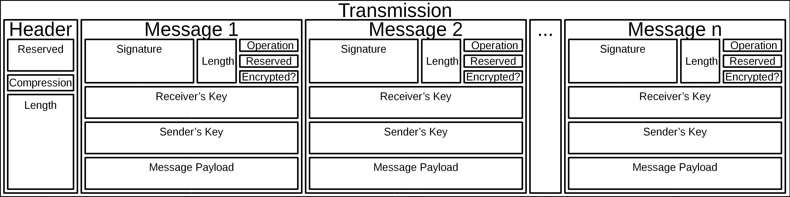
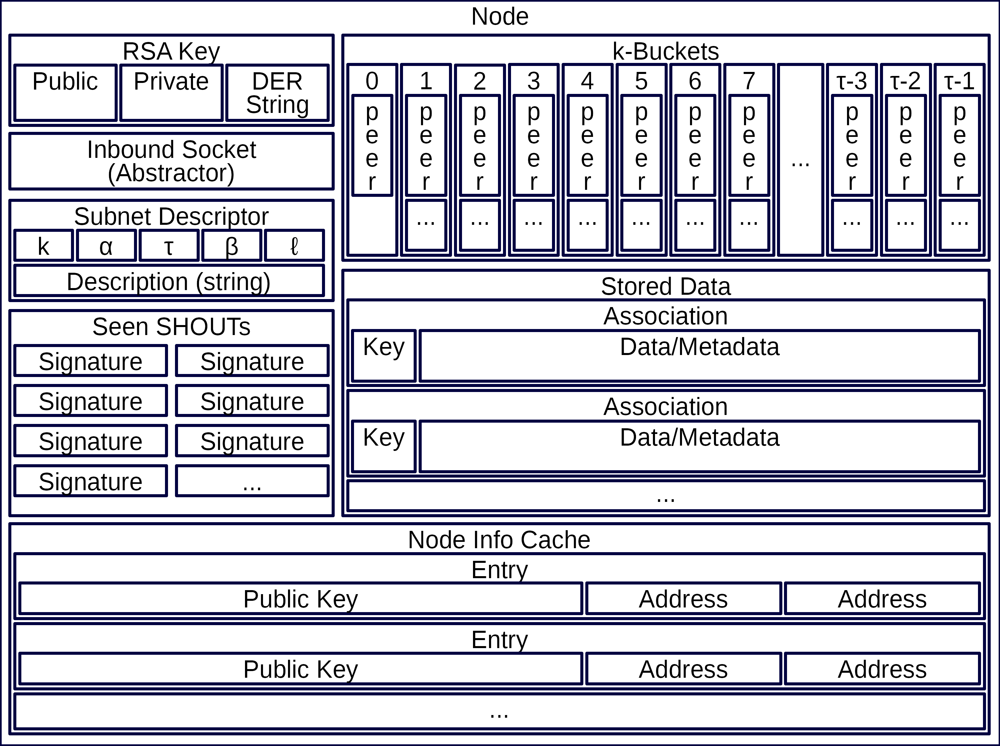
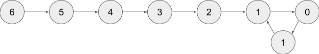
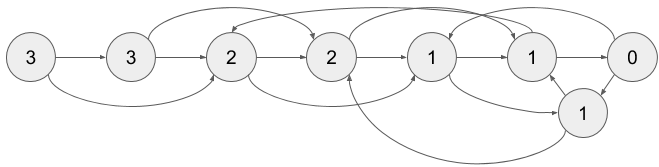

.. contents:: Table of Contents
    :backlinks: none
    :depth: 2

.. sectnum::

########
Abstract
########

This document is meant to describe a peer-to-peer networking protocol that can
be reasonably implemented in any popular language. Its principle goals are

1. Must work with nodes which can only initiate connections (done)

    1. Caveat: at least one node must be able to accept connections (done)

2. Must be capable of network-wide broadcasts (done)

    1. Must scale better than O(n\ :sup:`2`\ ) (done)
    2. Lag factor (compared to hub-and-spoke) must be < O(n) (done)

3. Must be capable of broadcasting only to direct peers (done)
4. Must be capable of sending messages to specific nodes (done)

    1. And be able to optionally encrypt it (opt-in or opt-out) (done)

5. Should have public keys as address (done)
6. Should be able to support a `Kademlia`_-like distributed hash table (done)

    1. This table should be able to have locks
    2. This table should be able to support atomic changes
    3. This table should be able to support diff-based changes

#####
Notes
#####

While this document will make references to object diagrams, please be aware
that we are not dictating how you must implement things. If a different
implementation can achieve the same results, then by all means use it,
especially if it's simpler or more elegant.

Also, this document will largely be written with Python in mind, partly because
it reads like pseudocode, and partly because I am most comfortable with it. I
will use type annotations as a guide for static languages.

#########
Constants
#########

=================
Network Constants
=================

These are the set of constants which manage network topology. They determine
things like how many peers one can have, or the number of bits in your address
space. Explanations will be given when these numbers are non-arbitrary.

* ``k``: `Kademlia`_'s replication parameter (max size of k-bucket, # of
  ``STORE`` calls)
* ``α``: Kademlia's concurrency parameter (number of parallel lookups)
* ``τ``: Kademlia's address size (number of bits to consider per address/hash)
* ``β``: The size of an extended address (bit length of public key)
* ``ℓ``: The limit on a node's self-initiated connections (at most kτ + 2k -
  ⌈k×log\ :sub:`2`\ (k+1))⌉

=======
Opcodes
=======

These are the values of the various opcodes used in this project. While their
values are arbitrary, their ranges are chosen to take the smallest space
possible when serialized.

* ``ACK``: 0
* ``NACK``: 1
* ``PING``: 2
* ``SET_CONNECTION_OPT``: 3
* ``ANNOUNCE``: 4
* ``CHANGE_KEY``: 5
* ``SHOUT``: 6
* ``SPEAK``: 7
* ``WHISPER``: 8
* ``FIND_NODE``: 9
* ``FIND_VALUE``: 10
* ``STORE``: 11
* ``RESERVED``: 12-14
* ``CUSTOM``: 15

===============================
Connection Options and Settings
===============================

These are the values of the various connection options used in this project. In
the lexicon of this paper, "option" will refer to a key, while "setting" will
refer to a value. So for the compression option, you can have a setting
``zlib``. While their values are arbitrary, their ranges are chosen to take the
smallest space possible when serialized.

~~~~~~~~~~~
Compression
~~~~~~~~~~~

This option is used to set what compression methods are available. The default
is that none are available. If the method is not supported by the peer,
they will return a ``NACK``.

Option: 0

Settings:

* ``none``: 0 (default)
* ``bz2``: 1
* ``gzip``: 2
* ``lzma``: 3
* ``zlib``: 4
* ``snappy``: 5
* ``reserved``: 6-7

~~~~~~~~~~~~~~~~~~~~~
Preferred Compression
~~~~~~~~~~~~~~~~~~~~~

This option is used if you have a preferred compression method. The default is
to let your peer decide. If the method is not supported by the peer, they will
return a ``NACK``.

Option: 1

Settings:

* ``none``: 0
* ``bz2``: 1
* ``gzip``: 2
* ``lzma``: 3
* ``zlib``: 4
* ``snappy``: 5
* ``reserved``: 6-7

~~~~~~
Subnet
~~~~~~

This option is used to confirm that you belong to the same network. It compares
your network constants and a description of the network. If any of these differs
it returns a ``NACK``. Upon a ``NACK`` for this, sent or received, you should
disconnect.

Option: 2

Setting: [k, α, τ, β, ℓ, <transport method>, <network description>]

##############
Message Format
##############

============
Segmentation
============

Messages in this protocol can—and should—be batched together before sending.
Because of this, we need to define segments.

~~~~~~~~~~~~~~~~~~~
Transmission Header
~~~~~~~~~~~~~~~~~~~

The transmission header consists of 6 bytes. The first 2 bytes contains the
option section. It consists of a bitmap describing how the transmission is
packed. This table is shown below. The other 4 bytes contain a big endian,
unsigned integer which says how long the rest of the transmission will be.

.. table:: Transmission Header Bitwise Layout

    +-------+-----------------------------------------------------+
    | Bits  | Meaning                                             |
    +=======+=====================================================+
    | 0-12  | Reserved                                            |
    +-------+-----------------------------------------------------+
    | 13-15 | Compression method (as defined in network settings) |
    +-------+-----------------------------------------------------+
    | 16-47 | Length of remaining transmission                    |
    +-------+-----------------------------------------------------+

~~~~~~~~~~~~~~
Message Header
~~~~~~~~~~~~~~

The message header consists of 114 + (β ÷ 4) bytes described in the below table.
(38 of this comes from metadata added by our protocol, 76 from DER overhead, and
2β ÷ 8 from the keys themselves.)

The signature is applied to all parts of the message that come after it. In
other words, it is based on everything from bit 256 onwards, including the
payload.

.. table:: Message Header Bitwise Layout

    +------------------+--------------------------------------------+
    | Bits             | Meaning                                    |
    +==================+============================================+
    | 0-255            | RSA signature (SHA-256, PSS padding)       |
    +------------------+--------------------------------------------+
    | 256-287          | Length of message payload                  |
    +------------------+--------------------------------------------+
    | 288-291          | Operation (as defined in RPCs)             |
    +------------------+--------------------------------------------+
    | 292-302          | Reserved                                   |
    +------------------+--------------------------------------------+
    | 303              | Indicates whether the message is encrypted |
    +------------------+--------------------------------------------+
    | 304-(607+β)      | From public key (DER format)               |
    +------------------+--------------------------------------------+
    | (608+β)-(911+2β) | To public key (DER format)                 |
    +------------------+--------------------------------------------+

--------------------------
Isn't that a little large?
--------------------------

Yes. But there are some reasonable counterpoints against that.

First, you can reduce the overhead from this by batching messages together.
Since compression happens at the transmission level, more often than not the
from and to keys will match from message to message. That means you rarely need
to repeat those fields.

Second, this format allows you to verify it was sent by the public key given. It
means that if you implement a system where certain stored values are "owned" by
a given node, it's much easier to verify if the node requesting the change is
allowed to.

Third, if we need to trade overhead for security, that can be a very worthwhile
trade. True, it's not necessary for everything, but that doesn't mean there
should be no balance between the two.

~~~~~~~~~~~~~~~
Message Payload
~~~~~~~~~~~~~~~

The message payload is an object encoded using the `msgpack`_ standard. If the
encryption bit is set, this section will be encrypted using the to public key.

-----------
Limitations
-----------

In order to preserve the maximum compatibility, we impose additional
restrictions on the types of objects that may be encoded. You may pack any of
the following:

1. Nil
2. Booleans
3. Doubles (including NaN, Inf, and -Inf)
4. Integers from -(2\ `63`:sup:) to (2\ `64`:sup:)-1
5. Strings smaller than length 2\ `32`:sup:
6. Buffers smaller than length 2\ `32`:sup:
7. Lists containing fewer than 2\ `32`:sup: items
8. Maps containing fewer than 2\ `32`:sup: associations, with string keys

This may be extended if the various msgpack libraries support serializing
addiitonal types. At the time of writing this, timestamps have just entered
the msgpack specification. They are largely unimplemented in the various msgpack
libraries.

-------------
Why not JSON?
-------------

Partly because of licensing concerns, but mostly because in most languages,
msgpack is faster. It's also significantly denser. Consider serializing the
string ``\x00\x00\x01\xff``, something you might do fairly often in this
library.

JSON: ``" \\ u 0 0 0 0 \\ u 0 0 0 0 \\ u 0 0 0 1 \\ u 0 0 f f "``

`msgpack`_: ``\xc4 \x04 \x00 \x00 \x01 \xff``

That's 26 bytes to msgpack's 6.

~~~~~~~~~~~~~~~~~~~~~
Transmission Overview
~~~~~~~~~~~~~~~~~~~~~

Each transmission will start with a Transmission Header, and at least one pair
of Message Header and Payload. Message Headers and Payloads *always* come in
associated pairs, and they are *always* directly next to each other.

   Graphical representation of a transmission

===========
Serializing
===========

Each step will be both explained, and written in a python-like pseudocode.

.. code-block:: python

    # Note that while you would ordinarily use classes for this, I will be using
    # tuples for the sake of brevity
    # Also note that MsgPackable is a union type.

    def make_tx(compression, *messages):  # type: (int, *bytes) -> bytes
        """Make a transmission from a collection of messages"""
        payload = b"".join(messages)  # type: bytes
        payload = compress(payload, compression)
        # packs a null byte, an unsigned byte, and a big-endian 32 bit
        # unsigned int
        return struct.pack("!xBL", compression % 8, len(payload)) + payload

    def make_msg(to,  # type: RSA_Key
                 op,  # type: int
                 payload,  # type: MsgPackable
                 priv_key,  # type: RSA_Key
                 encrypted=False  # type: bool
        ):  # type: (...) -> bytes
        """Constructs a serialized message"""
        msg_payload = msgpack.packb(payload)  # type: bytes
        msg_to = to.encode()  # type: bytes
        msg_from = priv_key.pub_key.encode()  # type: bytes
        if encrypted:
            msg_payload = to.encrypt(msg_payload)
        msg_no_sig = b"".join(
            # packs a big-endian 32 bit unsigned int, then an unsigned byte,
            # then a bool
            struct.pack("!LB?", len(msg_payload), (op % 16) << 4, encrypted),
            msg_to,
            msg_from
        )  # type: bytes
        msg_sig = priv_key.sign(msg_no_sig)  # type: bytes
        return msg_sig + msg_no_sig

=============
Deserializing
=============

Each step will be both explained, and written in a python-like pseudocode.

.. code-block:: python

    def parse_tx(transmission):  # type: (bytes) -> Iterator(Tuple)
        """Splits one transmission into its message components"""
        # note: tx is short for transmission
        tx_opts = transmission[:2]  # type: bytes
        # Now we parse the length. Luckily the standard library can do that
        tx_len = struct.unpack("!L", transmission[2:6])[0]  # type: int
        tx_payload = transmission[6:]  # type: bytes
        tx_compression = tx_opts[1] % 8  # type: int

        # Here we will decompress only the first tx_len bytes
        tx_payload = decompress(tx_payload[:tx_len], tx_compression)
        to_parse = len(tx_payload)  # type: int
        parsed = 0  # type: int

        while parsed < to_parse:
            msg_header = tx_payload[parsed : parsed + 114 + 2*β]  # type: bytes
            parsed += 114 + 2 * β
            msg_sig = msg_header[:32]  # type: bytes
            # Now we parse the length. Luckily the standard library can do that
            msg_len = struct.unpack("!L", msg_header[32:36])[0]  # type: int
            msg_op = msg_header[36] >> 4  # type: int
            msg_encrypted = msg_header[37] & 1  # type: int
            msg_from = msg_header[38:76+β/8]  # type: bytes
            msg_to = msg_header[76+β/8:114+β/4]  # type: bytes
            # Note that we don't unpack the payload on parse time, since it
            # could be encrypted. One could also have it that they payload is
            # not accessible at all if it's encrypted. Or some other solution.
            msg_payload = tx_payload[parsed : parsed + msg_len]  # type: bytes
            parsed += msg_len
            # In production you would probably use a class, but for brevity's
            # sake, we'll yield a tuple here
            yield (msg_sig, msg_from, msg_to, msg_len, msg_encrypted, msg_payload)

After being split in this way, it will get sent on to the protocol parser to
determine what to do with each message.

###############
Object Overview
###############

Please note that these are guidelines. Actual implementations can vary. In
addition, parts of these guidelines will only work effectively if your language
has either function pointers or first class functions.

===============
Basic Structure
===============

    Object Diagram for a Network Node

~~~~~~~
RSA Key
~~~~~~~

This object is a set of three related items. The first is your private key. The
second is your public key. And the last is a cached version of its DER encoding.

In some languages this will be one object. In others it will be two objects. In
a few it will be three. For the purposes of representing it, we will treat it as
one object, since you can derive all parts from the private key.

~~~~~~~~~~~~~~~~~~~~~~~~~~~
Inbound Socket (Abstractor)
~~~~~~~~~~~~~~~~~~~~~~~~~~~

This is listed as an abstractor because it allows for a common socket API,
regardless of transport type. In the Python implementation, this abstractor
would consist of:

* A thread or event loop to listen for incoming data, connections
* A distributor to get this data to the correct peer (in UDP-like transports)
* A variety of methods for sending data more conveniently

Other implementations may do this differently, but having this general framework
allows one to focus less on the details of a particular transport method.

~~~~~~~~~~~~~~~~~
Subnet Descriptor
~~~~~~~~~~~~~~~~~

A subnet descriptor is designed to check the network constants of your peers. It
should be sent over in the initial connection stage, and if there's a mismatch,
the nodes should immediately disconnect from each other.

This can also be used to find peers, if one has a distributed hash table of
active nodes, keyed by their descriptor. This paper will describe how such a
table might work towards the end.

~~~~~~~~~
k-Buckets
~~~~~~~~~

----
Peer
----

~~~~~~~~~~~
Seen SHOUTs
~~~~~~~~~~~

This object should be considered a set of recently seen signatures. When a node
receives a SHOUT, it should look at this set, and if it contains the appropriate
signature, ignore the SHOUT.

To prevent overgrowth of the set, it should be trimmed over time. This can be
done by time of message, capping the size, or some other method. In general a
method which eliminates the least recently received signature should be
preferred.

~~~~~~~~~~~
Stored Data
~~~~~~~~~~~

--------
Metadata
--------

~~~~~~~~~~~~~~~
Node Info Cache
~~~~~~~~~~~~~~~

This should serve as a cache for the data of nodes that a node cannot currently
connect to, usually because of limiting network constants.

For instance, if a node receives an ANNOUNCE but it already has ℓ outward
connections, it can instead place the relevant information in this cache. Then,
when a peer disconnects, it can refer to this cache to keep its k-buckets
optimally full.

================
Protocol Parsing
================

=====================
Connection Management
=====================

####
RPCs
####

This section describes how your node should respond to incoming network messages

=======
ACK [*]
=======

This is the RPC that should be sent back to acknowledge a network message as
successful, and provide return data if necessary.

Note that the arguments are contained in a list.

========
NACK [*]
========

This is the RPC that should be sent back to acknowledge a network message as
failed, and provide return data if necessary.

Note that the arguments are contained in a list.

====
PING
====

Always respond with ``ACK [PING]``. This will be utilized heavily in datagram
protocols like UDP or µTP.

========================================
SET_CONNECTION_OPT [<option>, <setting>]
========================================

This will take two arguments. The first will be the option you wish to set, and
the second is what you will set it to. Typically this will be something like
enabling a compression method, or setting one as preferred.

Should either respond ``ACK [SET_CONNECTION_OPT, <option>, <setting>]`` or
``NACK [SET_CONNECTION_OPT, <option>, <setting>]``, depending on if your node
supports this setting.

Note that the arguments are contained in a list.

========
ANNOUNCE
========

This RPC is used to announce your presence to the network. It is relayed like
``SHOUT``, and does not require an ``ACK``.

=====================================
CHANGE_KEY [<current key>, <new key>]
=====================================

This RPC is used as a key change mechanism. Essentially, it allows you to change
your public key every so often. This can be used to make it more difficult to
impersonate a node. It is relayed like ``SHOUT``, and does not require an
``ACK`` except from your direct peers.

===============
SHOUT <message>
===============

This indicates that a message should be forwarded to all peers if you have not
previously seen it. ``ACK``\ s are ill-advised here.

Assuming the above, and that ``ℓ`` is obeyed, we should be able to make some
reasonable assumptions.

~~~~~~~~~~~~~~~~~~~
Defining Some Terms
~~~~~~~~~~~~~~~~~~~

::

    n    number of nodes on the network
    ℓ    the limit on outward connections
    m    the number of messages per broadcast
    t    sum(node.num_connections for node in nodes)

~~~~~~~~~~~~~~~~~~~~~~~~~~~~~~~~
Special Case: Saturated Networks
~~~~~~~~~~~~~~~~~~~~~~~~~~~~~~~~

This case is less efficient in most situations. Because each node can
see all other nodes, we can say that it has (n - 1) connections. Each
node will relay to all but one of its connections, except the original
sender, who sends it to all. Therefore we can say:

::

   t = (n - 1) × n
   m = t - n + 1
   = (n - 1) × n - n + 1
   = n^2 - 2n + 1
   = (n - 1)^2
   = Θ(n^2)

.. figure:: pics/saturatednetworkgraph.png
    :alt: Data sent to nodes on a network for a single broadcast in (saturated)

    Data sent to nodes on a network for a single broadcast in saturated networks

~~~~~~~~~~~~~~~~~~~~~~~~~~~~~~
Special Case: Limited Networks
~~~~~~~~~~~~~~~~~~~~~~~~~~~~~~

A limited network is where each node has ℓ outward connections. This is
the limit set in software, so a node will not initiate more than ℓ
connections on its own. Because connections must have another end, we
can conclude that the average number of inward connections per node is also ℓ.
Therefore:

::

   t = 2ℓ × n
   m = t - n + 1
   = 2ℓ × n - n + 1
   = (2ℓ - 1) × n + 1
   = Θ(n)

.. figure:: pics/limitednetworkgraph.png
    :alt: Data sent to nodes on a network for a single broadcast in (limited)

    Data sent to nodes on a network for a single broadcast in limited networks

~~~~~~~~~~~~~~~
Crossover Point
~~~~~~~~~~~~~~~

You should be able to show where these two domains meet by finding the point
where m is equal.

::

    (n - 1)^2 = (2ℓ - 1) × n + 1
    n^2 - 2n + 1 = (2ℓ - 1) × n + 1
    n^2 - 2n = (2ℓ - 1) × n
    n - 2 = 2ℓ - 1
    n = 2ℓ + 1

.. figure:: pics/crossovergraph.png
    :alt: Data sent to nodes on a network for a single broadcast

    Data sent to nodes on a network for a single broadcast

~~~~~~~~~~~~
Lag Analysis
~~~~~~~~~~~~

I managed to find the worst possible network topology for lag that this
library will generate. It looks like figures 6 and 7.

   Delay in hops for a worst-case network with ℓ=1

   Delay in hops for a worst-case network with ℓ=2

The lag it experiences is described by the following formula (assuming similar
bandwidth and latency):

::

    lag = ceil(max((n-2) ÷ ℓ, 1)) for all networks where n > 2ℓ + 1

~~~~~~~~~~
Conclusion
~~~~~~~~~~

From this, we can gather the following:

1. For all networks where n < 2ℓ + 1, m is Θ(n^2)
2. For all networks where n >= 2ℓ + 1, m is Θ(n)
3. All networks are O(n)
4. Lag follows ceil(max((n-2) ÷ ℓ, 1))

~~~~~~~~~~~~~~~~~~~~~~~~~~~~~~~~~~~~~~
Comparison to Centralized Architecture
~~~~~~~~~~~~~~~~~~~~~~~~~~~~~~~~~~~~~~

When comparing to a simplified server model, it becomes clear that there is a
fixed, linearly scaling cost for migrating to this peer-to-peer architecture.

The model we'll compare against has the following characteristics:

1. When it receives a message, it echoes it to each other client
2. It has ℓ threads writing data out
3. Each client has similar lag and bandwidth

Such a network should follow the formula:

::

    lag = ceil((n-1) ÷ ℓ) + 1

This means that, for any network comparison of equal ℓ and n, you have the
following change in costs:

1. Worst case lag is *at worst* the same as it was before (ratio ≤ 1)
2. *Total* bandwidth used is increased by a factor of 2ℓ - 1 + (1 ÷ n)

Therefore, we can conclude that this broadcast design satisfies the given
requirements for an efficient protocol.

===============
SPEAK <message>
===============

This indicates that a message may be forwarded to all peers *at your
discretion*, if you have not previously seen it. By default a node should *not*
forward it, but there are some situations where it might be desirable.

``ACK``\ s are not necessary except on UDP-like transports, since the nodes
receiving this message are directly connected. If it is difficult to implement
this conditional, send the ``ACK`` by default.

=================
WHISPER <message>
=================

This indicates that a message is intended for a specific destination. The
message may or not be encrypted. That should be handled on the message parser
level.

Acknowledge these messages in the format ``ACK [WHISPER, <message signature>]``.

~~~~~~~~~~~~~~~~~~~~~
If Directly Connected
~~~~~~~~~~~~~~~~~~~~~

Send the message directly. Encrypt if using an insecure transport method.
Otherwise encryption is optional.

~~~~~~~~~~~~~~~~~~~~~~~~~
If Not Directly Connected
~~~~~~~~~~~~~~~~~~~~~~~~~

Otherwise things can be ambiguous. Both of these methods should be supported,
but the decision on which to take should be made locally.

---------
Iterative
---------

This strategy should be preferred if your k-buckets are not yet filled.
Essentially you should issue ``FIND_NODE`` RPCs until you've received the info
for the node you are looking for. When this has happened, send directly. Under
this scheme, encryption follows the same rules as if you are directly connected,
because you will be.

---------
Recursive
---------

This strategy should be preferred if your k-buckets *are* filled. To do this,
you issue a ``WHISPER`` RPC to the closest node you have. They will then follow
this same decision tree. In this scheme encryption is *mandatory*.

============================
FIND_NODE <extended address>
============================

This is mostly defined by the `Kademlia`_ spec. Essentially, they send you an
address, and you reply with the ``k`` closest nodes you're aware of to that
address, where distance is given by ``XOR(<extended address>, addr) % 2**τ``. If
you don't know of ``k`` nodes, send back as many as are known. Format like
``ACK [FIND_NODE, <node 0 info>, <node 1 info>, ...]``.

=======================================
FIND_VALUE [<truncated address>, <key>]
=======================================

While the address can be computed directly from the key, both are included to
save computation time.

Note that the arguments are contained in a list.

~~~~~~~~~~~~~~~~
If Value Unknown
~~~~~~~~~~~~~~~~

Respond as if it was a ``FIND_NODE`` RPC.

~~~~~~~~~~~~~~
If Value Known
~~~~~~~~~~~~~~

Respond in the format ``ACK [FIND_VALUE, <key>, <value>, <metadata>]``. Metadata
is defined in the Object Overview section.

===========================================
STORE [<truncated address>, <key>, <value>]
===========================================

While the address can be computed directly from the key, both are included to
save computation time. It should ``ACK`` in a similar format to ``FIND_VALUE``.

Note that the arguments are contained in a list.

================
CUSTOM <message>
================

This is the opcode reserved for building on top of this protocol. Part of the
public API is a way to hook into the protocol parser. This opcode indicates that
a message is meant for this part of the API, rather than a part of the protocol
defined above.

##########
Public API
##########

.. _Kademlia:
        https://pdos.csail.mit.edu/~petar/papers/maymounkov-kademlia-lncs.pdf

.. _msgpack:
        https://github.com/msgpack/msgpack/blob/master/spec.md
